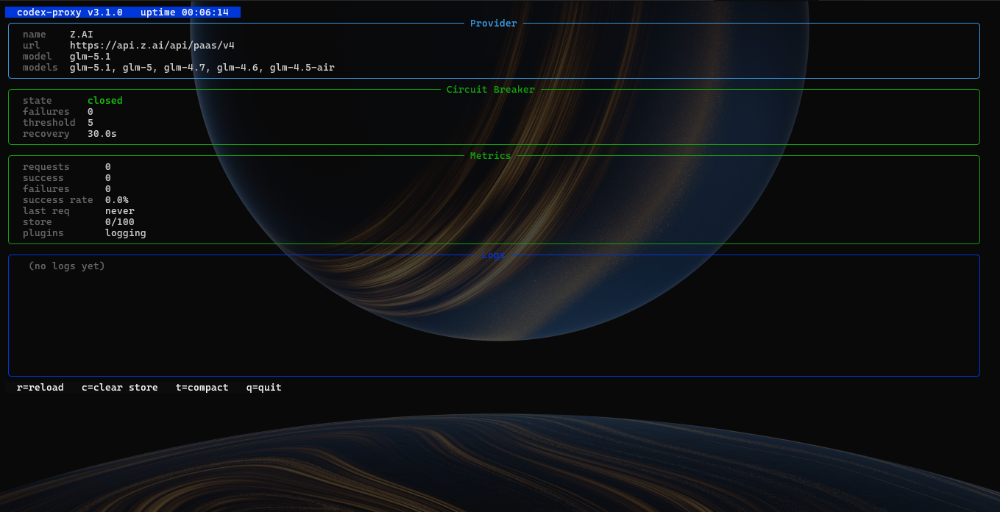

<div align="center">

# 🚀 codex-proxy

**The lightweight LLM gateway that speaks every AI model's language**

Use Codex CLI, Cursor, or any OpenAI-compatible tool with **any provider** —  
Z.AI, Groq, Together AI, OpenRouter, Ollama, Anthropic, Gemini, DeepSeek, and 10+ more.

[](https://github.com/ZiryaNoov/codex-proxy/actions/workflows/ci.yml)
[](https://pypi.org/project/codex-proxy/)
[](https://pypi.org/project/codex-proxy/)
[](https://github.com/ZiryaNoov/codex-proxy/blob/main/LICENSE)
[](https://github.com/ZiryaNoov/codex-proxy)
[](https://github.com/ZiryaNoov/codex-proxy)

[Installation](#-install-in-30-seconds) · [Features](#-features) · [Quick Start](#-quick-start) · [API Reference](#-api-reference) · [Docs](#configuration-reference)

</div>

---

## 💡 What does it do?

```
┌──────────┐     ┌──────────────┐     ┌─────────────────┐
│ Codex CLI│────>│              │────>│ Z.AI (GLM-5.1)  │
│ Cursor   │     │  codex-proxy │     │ Groq (Llama 4)  │
│ VS Code  │<────│  localhost    │<────│ Ollama (local)  │
│ Any tool │     │  :4242       │     │ Anthropic       │
└──────────┘     │              │     │ Gemini          │
                 │  Translate   │     │ DeepSeek        │
  Responses API  │  Route       │     │ OpenRouter      │
  protocol       │  Track costs │     │ ...any provider │
                 │  Authenticate│     └─────────────────┘
                 └──────────────┘
```

**One config file. One command. Every AI model.**

<div align="center">
  
  <br><em>Live TUI dashboard — real-time metrics, circuit breaker state, key rotation</em>
</div>

---

## ⚡ Install in 30 seconds

```bash
pip install codex-proxy
```

Done. That's it. Now set your API key and run:

```bash
export OPENAI_API_KEY=your-key
codex-proxy
```

Your proxy is live at `http://127.0.0.1:4242` 🎉

### Connect Codex CLI

```bash
export OPENAI_BASE_URL=http://127.0.0.1:4242
codex --model glm-5.1 "build me a REST API"
```

### With extras

```bash
pip install "codex-proxy[tui]"          # Live terminal dashboard
pip install "codex-proxy[documents]"    # PDF/DOCX → Markdown conversion
pip install "codex-proxy[enterprise]"   # JWT auth + PostgreSQL + encryption
```

---

## ✨ Features

### 🌐 Universal Compatibility
- **12+ providers** — Z.AI, Groq, Together, OpenRouter, Ollama, Fireworks, Anthropic, Gemini, DeepSeek, Mistral, Cohere, NVIDIA NIM
- **Protocol translation** — Responses API ↔ Chat Completions in real time
- **Streaming SSE** — token-by-token with full protocol mapping
- **WebSocket support** — full Realtime API envelope handling
- **Tool calls** — complete function calling support
- **Multi-turn** — `previous_response_id` conversation continuity

### 🧠 Smart Routing (v5)
- **4 strategies** — `fallback`, `cost` (cheapest), `latency` (fastest), `weighted` (load balanced)
- **Auto-failover** — if one provider is down, automatically switches to the next
- **Rolling latency tracker** — real-time health detection per provider

### 🔐 Auth & Security (v5)
- **JWT authentication** — login/signup/refresh with bcrypt password hashing
- **Multi-user** — each user gets their own API keys, budgets, and logs
- **Budget enforcement** — set daily/monthly spend limits per user
- **Admin panel** — seeded on first startup, full control

### 💰 Cost Analytics (v5)
- **Per-model pricing** — built-in pricing data for 25+ models
- **Real-time cost tracking** — every request logged with actual cost
- **Usage dashboards** — `/api/stats`, `/api/usage`, `/api/providers`
- **Cost breakdowns** — by model, by provider, by time period

### 📄 Document Pipeline (v5, NEW)
- **File → Markdown** — upload PDF, DOCX, XLSX, PPTX, HTML, images, audio → get Markdown
- **26 file formats** — powered by Microsoft MarkItDown
- **Document ingestion** — store converted documents in DB for RAG pipelines
- **REST API** — `/documents/convert`, `/documents/ingest`, `/documents`, `/documents/{id}`

### 🛡️ Reliability
- **Circuit breaker** — per-key + global fail-fast protection
- **Multi-key rotation** — round-robin with individual circuit breakers
- **Auto-retry** — configurable retries on 5xx/transport errors
- **Context compaction** — auto-trims long conversations

### 📊 Observability
- **Live TUI dashboard** — real-time metrics, key pool status, log tail, hotkeys
- **Web dashboard** — dark-themed HTML dashboard with cost charts and provider cards
- **Plugin system** — hook-based middleware (`on_request`, `on_response`, `on_error`)
- **Config hot-reload** — reload without restart via `POST /reload`

---

## 🏆 Why codex-proxy?

| | codex-proxy | LiteLLM | OpenRouter |
|---|---|---|---|
| **Install** | `pip install codex-proxy` | `pip install litellm[proxy]` | Sign up + API key |
| **Dependencies** | 6 | 50+ | N/A (hosted) |
| **Start time** | <1s | 3-5s | N/A |
| **Memory** | ~30MB | ~200MB+ | N/A |
| **Cost tracking** | ✅ Built-in | Via logging | ✅ Dashboard |
| **Smart routing** | 4 strategies | Basic | Basic |
| **Auth** | Built-in JWT | External | API keys |
| **Self-hosted** | ✅ | ✅ | ❌ |
| **Document conversion** | ✅ MarkItDown | ❌ | ❌ |
| **Open source** | ✅ MIT | ✅ MIT | ❌ |
| **Dashboard** | TUI + Web | Separate UI | Web only |

---

## 🚀 Quick Start

### 1. Install & Run

```bash
pip install codex-proxy
codex-proxy --init    # Creates ~/.codex-proxy/config.toml
codex-proxy           # Starts at http://127.0.0.1:4242
```

### 2. Set Your Provider

Edit `~/.codex-proxy/config.toml`:

```toml
[provider]
name = "zai"
base_url = "https://api.z.ai/api/paas/v4"
api_key_env = "OPENAI_API_KEY"
models = ["glm-5.1", "glm-5", "glm-4.7"]
default_model = "glm-5.1"
```

### 3. Use It

```bash
# With Codex CLI
export OPENAI_BASE_URL=http://127.0.0.1:4242
codex --model glm-5.1 "explain quantum computing"

# Convert a document to Markdown
curl -F file=@report.pdf http://127.0.0.1:4242/documents/convert

# Check health
curl http://127.0.0.1:4242/health
```

---

## 📋 API Reference

### Core Endpoints

| Endpoint | Method | Description |
|---|---|---|
| `POST /responses` | HTTP/WS | Responses API proxy (streaming + non-streaming) |
| `GET /responses/{id}` | GET | Retrieve stored response |
| `GET /models` | GET | List all models across providers |
| `GET /health` | GET | Health check (`?check_backend=true`) |
| `GET /status` | GET | Detailed server status |
| `POST /reload` | POST | Hot-reload config from disk |

### Auth (v5)

| Endpoint | Method | Description |
|---|---|---|
| `POST /auth/login` | POST | Login → JWT tokens |
| `POST /auth/signup` | POST | Register user |
| `POST /auth/refresh` | POST | Refresh access token |
| `GET /auth/me` | GET | Current user info |
| `GET /auth/budget` | GET | Budget status |
| `PUT /auth/budget` | PUT | Update budget limits |

### Dashboard & Analytics (v5)

| Endpoint | Method | Description |
|---|---|---|
| `GET /dashboard` | GET | Web dashboard (HTML) |
| `GET /api/stats` | GET | Aggregated stats + cost breakdown |
| `GET /api/usage` | GET | Usage history (`?model=&hours=`) |
| `GET /api/providers` | GET | Provider status + routing info |
| `GET /api/router/status` | GET | Router metrics + latency |

### Documents (v5, NEW)

| Endpoint | Method | Auth | Description |
|---|---|---|---|
| `POST /documents/convert` | POST | None | Upload file → get Markdown |
| `POST /documents/ingest` | POST | Optional | Upload + convert + store |
| `GET /documents` | GET | Optional | List documents |
| `GET /documents/{id}` | GET | Optional | Get document + markdown |
| `DELETE /documents/{id}` | DELETE | Required | Delete document + file |

```bash
# Convert a PDF to Markdown (no auth needed)
curl -F file=@report.pdf http://localhost:4242/documents/convert

# Ingest a document (stores for RAG)
curl -F file=@data.xlsx \
  -H "Authorization: Bearer TOKEN" \
  http://localhost:4242/documents/ingest

# List all ingested documents
curl http://localhost:4242/documents
```

---

## 🌍 Provider Examples

<details>
<summary><b>Z.AI (GLM Models)</b></summary>

```toml
[provider]
name = "zai"
display_name = "Z.AI"
base_url = "https://api.z.ai/api/paas/v4"
api_key_env = "OPENAI_API_KEY"
models = ["glm-5.1", "glm-5", "glm-4.7"]
default_model = "glm-5.1"
```
</details>

<details>
<summary><b>Groq (Llama, Mixtral)</b></summary>

```toml
[provider]
name = "groq"
base_url = "https://api.groq.com/openai/v1"
api_key_env = "GROQ_API_KEY"
models = ["llama-4-maverick-17b", "mixtral-8x7b-32768"]
default_model = "llama-4-maverick-17b"
```
</details>

<details>
<summary><b>Ollama (100% Local)</b></summary>

```toml
[provider]
name = "ollama"
base_url = "http://localhost:11434/v1"
api_key = "ollama"
models = ["qwen3:32b", "codellama:34b"]
default_model = "qwen3:32b"
```
</details>

<details>
<summary><b>Anthropic (Claude)</b></summary>

```toml
[provider]
name = "anthropic"
base_url = "https://api.anthropic.com/v1"
api_key_env = "ANTHROPIC_API_KEY"
models = ["claude-sonnet-4-20250514"]
default_model = "claude-sonnet-4-20250514"
```
</details>

<details>
<summary><b>Google Gemini</b></summary>

```toml
[provider]
name = "gemini"
base_url = "https://generativelanguage.googleapis.com/v1beta/openai"
api_key_env = "GEMINI_API_KEY"
models = ["gemini-2.5-flash"]
default_model = "gemini-2.5-flash"
```
</details>

<details>
<summary><b>DeepSeek</b></summary>

```toml
[provider]
name = "deepseek"
base_url = "https://api.deepseek.com/v1"
api_key_env = "DEEPSEEK_API_KEY"
models = ["deepseek-chat", "deepseek-reasoner"]
default_model = "deepseek-chat"
```
</details>

<details>
<summary><b>Mistral, Cohere, NVIDIA NIM, Together, Fireworks, OpenRouter...</b></summary>

All work the same way — just change `base_url`, `api_key_env`, and `models`. See the [example config](https://github.com/ZiryaNoov/codex-proxy/blob/main/src/codex_proxy/config.py) for all supported providers.
</details>

---

## 🔧 Multi-Provider Setup

Route between providers automatically:

```toml
# Enable routing
[router]
enabled = true
default_strategy = "cost"    # cheapest provider wins

# Define providers
[[providers]]
name = "zai"
base_url = "https://api.z.ai/api/paas/v4"
api_key_env = "OPENAI_API_KEY"
models = ["glm-5.1"]

[[providers]]
name = "groq"
base_url = "https://api.groq.com/openai/v1"
api_key_env = "GROQ_API_KEY"
models = ["llama-4-maverick-17b"]

[[providers]]
name = "deepseek"
base_url = "https://api.deepseek.com/v1"
api_key_env = "DEEPSEEK_API_KEY"
models = ["deepseek-chat"]
```

---

## 🔌 Plugin System

```toml
[plugins]
enabled = true
plugins = ["codex_proxy.plugins_builtin.LoggingPlugin"]
```

```python
from codex_proxy.plugins import Plugin, PluginContext

class MyPlugin(Plugin):
    async def on_request(self, ctx: PluginContext) -> None:
        # Modify request before it goes to provider
        pass

    async def on_response(self, ctx: PluginContext) -> None:
        # Post-process response before returning to client
        pass

    async def on_error(self, ctx: PluginContext) -> None:
        # Handle errors
        pass
```

---

## 🐳 Docker

```bash
docker build -t codex-proxy .
docker run -d -p 4242:4242 \
  -e OPENAI_API_KEY=your-key \
  -v ~/.codex-proxy:/root/.codex-proxy \
  codex-proxy
```

Or with Docker Compose:

```bash
docker compose up -d
```

---

## ⚙️ Configuration Reference

Config file: `~/.codex-proxy/config.toml`

| Section | Description |
|---|---|
| `[server]` | Host, port, timeouts, CORS, admin token |
| `[provider]` | Single provider config |
| `[[providers]]` | Multi-provider array |
| `[store]` | Response cache TTL and size |
| `[circuit_breaker]` | Failure threshold and recovery |
| `[compaction]` | Auto-trim long conversations |
| `[rate_limit]` | Per-client throttling |
| `[plugins]` | Hook-based middleware |
| `[database]` | SQLite or PostgreSQL (v5) |
| `[auth]` | JWT auth settings (v5) |
| `[router]` | Smart routing strategy (v5) |
| `[dashboard]` | Web dashboard (v5) |
| `[documents]` | MarkItDown conversion (v5) |

Run `codex-proxy --init` to generate a full example config with all options documented.

---

## 🛠️ Development

```bash
git clone https://github.com/ZiryaNoov/codex-proxy.git
cd codex-proxy
pip install -e ".[dev,tui]"
pytest tests/ -v    # 289 tests
ruff check src/     # lint
```

---

## 🤝 Contributing

1. Fork the repo
2. Create a feature branch (`git checkout -b feat/amazing-feature`)
3. Commit your changes
4. Push to your fork
5. Open a Pull Request

---

## 📄 License

[MIT](https://github.com/ZiryaNoov/codex-proxy/blob/main/LICENSE) — ZakPro

---

<div align="center">

**Found this useful? ⭐ Star the repo — it helps others find it!**

[⭐ Star on GitHub](https://github.com/ZiryaNoov/codex-proxy) · [🐛 Report Bug](https://github.com/ZiryaNoov/codex-proxy/issues) · [💡 Request Feature](https://github.com/ZiryaNoov/codex-proxy/issues)

</div>
